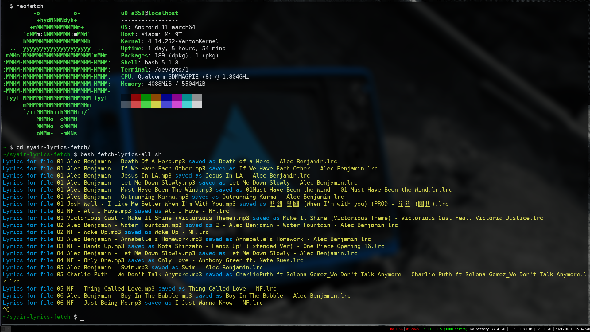

# syair-lyrics-fetch
Fetch Lyrics from syair.info and Save to Retro Music Lyrics Folder


This script is meant to run on Android Termux

## Getting started. 
### Requriements
`curl` `jq` `pup` `ncurses-utils`
- Make SURE they are installed before continuing!
- Give storage permisson for termux so that it can look for songs and write on lyrics folder.
- Clone repo, cd into repo dir and give it executable permissons
```
pkg install curl jq pup ncurses-utils
git clone https://github.com/shihaamabr/syair-lyrics-fetch
cd syair-lyrics-fetch
chmod +x *.sh
```

### For a specific song - fetch-lyrics.sh
Run the script with song name as arugment
eg:
```
./fetch-lyrics.sh "Not a Damn Thing Changed"
```


### For all songs - fetch-lyrics-all.sh
Run and watch it fetch lyrics and place them in Retro Music dir
```
./fetch-lyrics-all.sh
```
